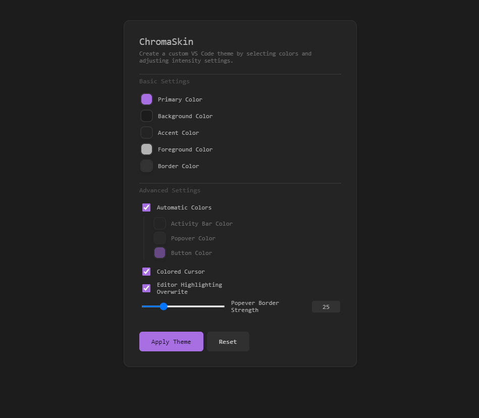
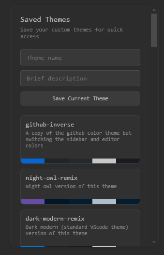
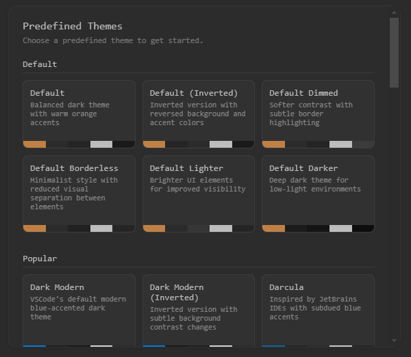

#  ChromaSkin

ChromaSkin lets you mix and match your favorite syntax highlighting with custom editor chrome colors. Keep the code highlighting you love while personalizing VS Code's overall look and feel.

## Basic Usage

1. Open Command Palette (`Ctrl+Shift+P` or `Cmd+Shift+P`)
2. Type "ChromaSkin" to see available commands
3. Select "ChromaSkin: Open Theme Generator"
4. In the theme generator:
    - Customize your editor chrome colors (Start with a predefined theme or create your own)
    - Preview changes
    - Save your customized theme

> [!TIP] Use the color picker's eyedropper tool to sample colors from anywhere on your screen to fine-tune any UI element

## 🎨 Theme Generator Preview

## 📖 Description

### 🧠 What is it?

You know how picking a theme in VS Code usually changes everything – from your sidebar, status bar, and tabs, to the actual code syntax colors?

**ChromaSkin decouples that.**
With it, you can:

-   Keep your favorite syntax token colors (One Dark, Dracula, Monokai Pro, Night Owl... whatever!)
-   Style the UI/chrome separately: activity bar, side panel, status bar, etc.
-   Mix and match for way more control over your setup
-   Save your favorite color palettes and apply them later
-   Import and export your theme configurations and share them with others

### 🎯 Why this is useful

Let's say you love Night Owl's syntax colors, but don't want the overall dark-blue UI. With ChromaSkin, you can keep Night Owl's token coloring and pair it with a warm, light chrome — or go all out with your own custom palette.

This opens up a whole world of personalization without sacrificing your coding flow.

### 🎨 Theme Style Inspiration

The default chrome themes in ChromaSkin are inspired by the clean, modern aesthetics of:

-   GitHub's VS Code theme
-   VS Code's built-in Dark+ theme

## 📖 Features

### 💾 Saved Themes

ChromaSkin allows you to save your custom theme configurations for later use. Once you've created the perfect combination of colors:

-   Save your theme with a custom name
-   Apply saved themes with a single click
-   Export themes to share with others or use across different machines

### 🎭 Predefined Themes

Get started quickly with dozens of carefully crafted predefined themes across multiple categories:

-   **Default themes** - Balanced themes with warm accents
-   **Popular themes** - Dark Modern, Tokyo Night, Dracula, and more
-   **Specialized collections** - GitHub, Monokai, One Dark, Catppuccin variants
-   **Tutorial themes** - Special themes that demonstrate which colors affect which UI elements

## 🤝 Contributing

Contributions are welcome! Please feel free to submit a Pull Request.

## 📄 License

This extension is licensed under the [MIT License](LICENSE).
