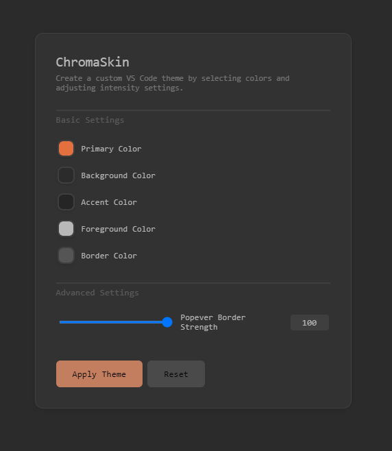

# ChromaSkin

ChromaSkin lets you mix and match your favorite syntax highlighting with custom editor chrome colors. Keep the code highlighting you love while personalizing VS Code's overall look and feel.

## ✨ Features

ChromaSkin separates VS Code's chrome (UI elements like activity bar, sidebar, panels) from syntax highlighting, giving you unprecedented customization:

- 🎨 Use any syntax highlighting theme you love
- 🎯 Customize only the editor chrome/UI colors
- 🖼️ Keep your preferred token colors untouched

Here's how it looks in action:

## 🚀 Getting Started

1. Install ChromaSkin from the VS Code Marketplace
2. Open Command Palette (`Ctrl+Shift+P` or `Cmd+Shift+P`)
3. Type "ChromaSkin" to see available commands

## 🎨 Recommended Syntax Themes

ChromaSkin works great with popular VS Code themes like:

- [One Dark Pro](https://marketplace.visualstudio.com/items?itemName=zhuangtongfa.Material-theme)
- [Dracula Official](https://marketplace.visualstudio.com/items?itemName=dracula-theme.theme-dracula)
- [GitHub Theme](https://marketplace.visualstudio.com/items?itemName=GitHub.github-vscode-theme)
- [Night Owl](https://marketplace.visualstudio.com/items?itemName=sdras.night-owl)
- [Monokai Pro](https://marketplace.visualstudio.com/items?itemName=monokai.theme-monokai-pro-vscode)

## 📝 Release Notes

### 1.0.0

- Initial release of ChromaSkin
- Support for independent chrome/syntax theming
- Light and dark mode support
- Custom accent color options

## 🤝 Contributing

Contributions are welcome! Please feel free to submit a Pull Request.

## 📄 License

This extension is licensed under the [MIT License](LICENSE).

---

**Enjoy your personalized VS Code experience with ChromaSkin! 🎉**
